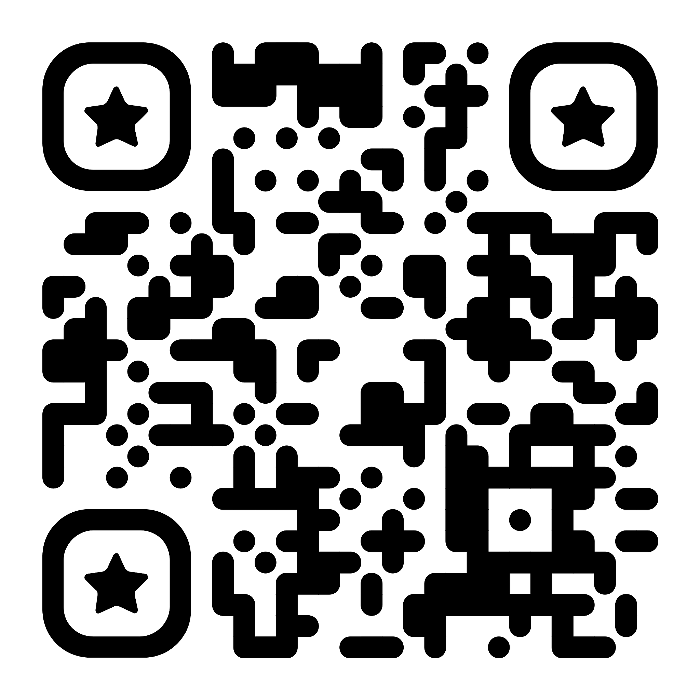

# Contacts

- <fancy-link href="https://t.me/olovyannikov_frontend">@olovyannikov_frontend</fancy-link>
- <fancy-link href="https://t.me/moscowjschat">@moscowjschat</fancy-link>
- <fancy-link href="https://github.com/Olovyannikov">@Olovyannikov</fancy-link>

::window::

