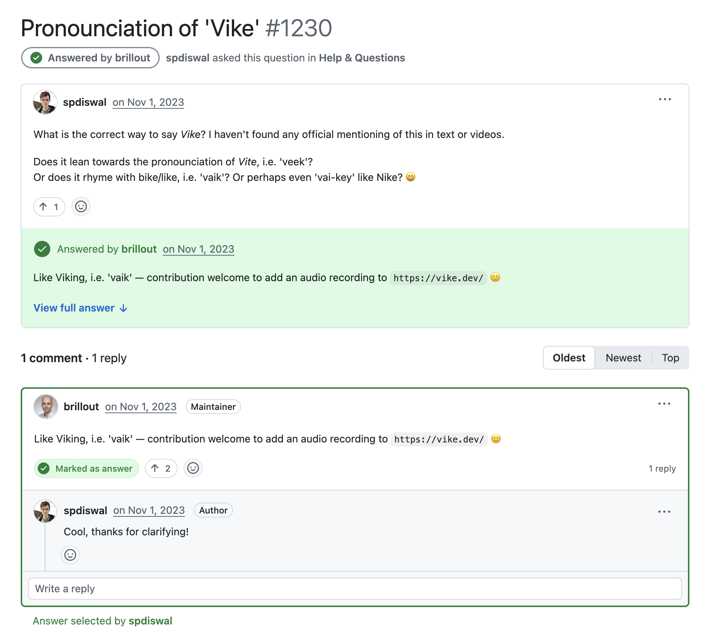

# Вайк? Вик? Вике?

<Counter/>

    

        
    

    <h3 class="prose-2xl center my-auto dark:color-white">+</h3>
    

    

<h3 class="prose-2xl center my-auto dark:color-white">=</h3>

        

<h2 class="dark:color-white">Vikings + Like = Vike</h2>

::window::

