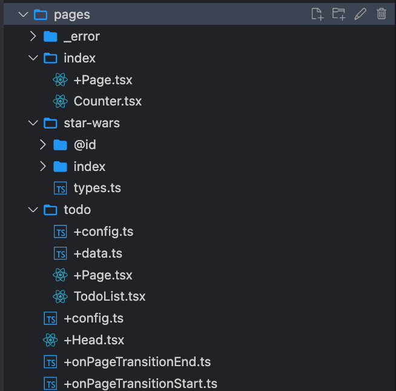

# Из чего состоит приложение

    <ul>
        <v-clicks>
        <li>Optional zero-config приложение;</li>
        <li>Набор правил по именованию сущностей;</li>
        <li> Конфиг <code>+config.ts</code>;</li>
        <li>File-based роутинг в каталоге <code>pages</code>;</li>
        <li> Страницы внутри каталогов <code>+Page.tsx</code>;</li>
        <li> Примеры vike-хуков.</li>
        </v-clicks>
    </ul>
    

