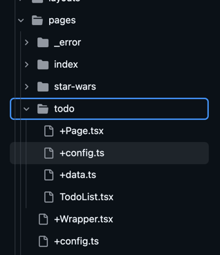

# +config.ts

<style>
.config-wrapper > div {
    display:grid;
    grid-template-columns: 1.5fr 1fr;
    gap: 1rem;
}

[data-slidev-no="24"] span:first-child.highlighted:has(+ .dishonored) span {
    color: black !important;
    font-weight: 600;
    background-color: #E3F9B4;
}
</style>


<div class="config-wrapper">

<div>

```ts {*|4|7-11|13-15|17-20|22-23}{startLine: 4,lines: true}
// Default config (can be overridden by pages)
export default {
    // base options
    extends: [vikeReact], // vikeVue, vikeReactQuery etc...
    reactStrictMode: false,
    cacheControl: "public, max-age=86400",
    prefetchStaticAssets: "viewport",
    ssr: true, // true by default

    // Wrappers
    Layout: RootLayout, // Layout всего приложения
    Head: HeadDefault, // Дефолтный <head />

    // meta tags
    lang: "en",
    title: "My Vike App",
    description: "Demo showcasing Vike",

    // meta info
    passToClient: ['scopeValues', 'device', 'isMobile'],

} satisfies Config;
```

<div>
    
</div>
</div>
</div>

