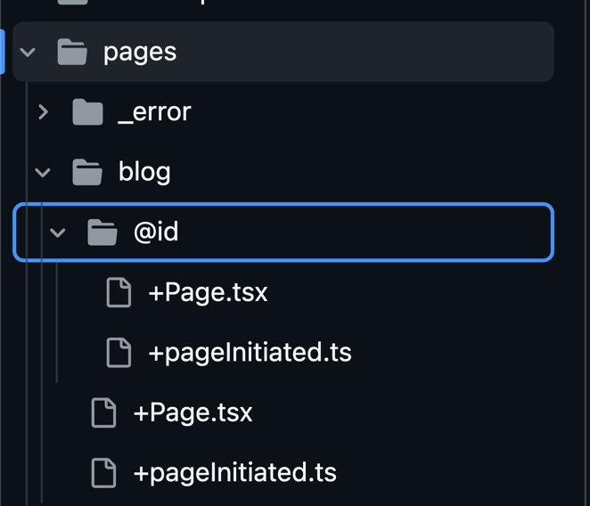
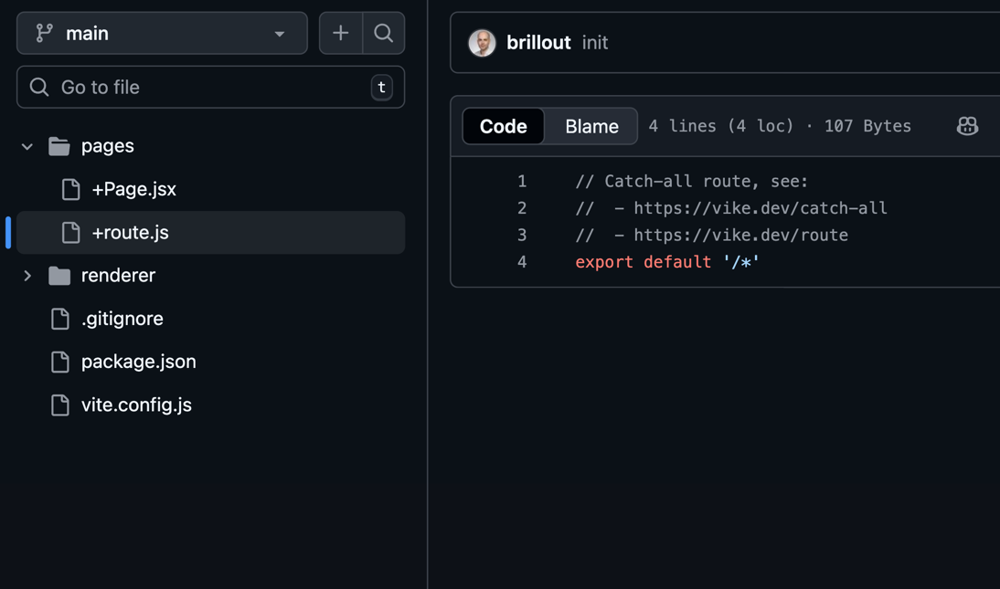
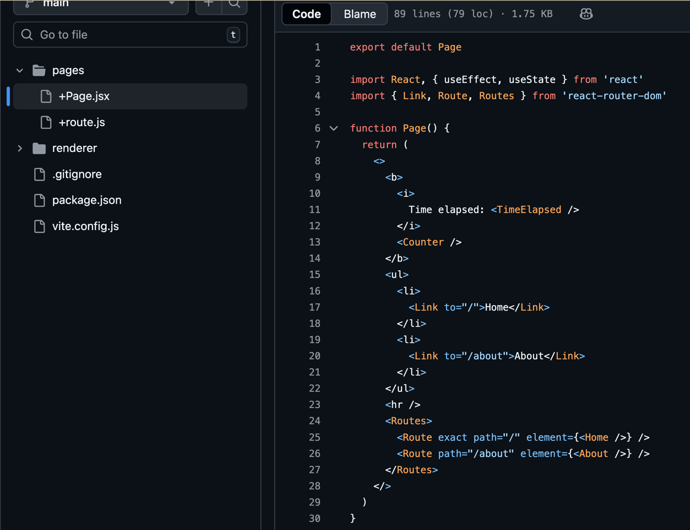

# Навигация

<v-clicks>

<v-click>

- По-умолчанию `File-Based Routing`;

</v-click>
<v-click>

- Можно переопределять `route string`   или `route matching function`;

</v-click>
<v-click>

- Можно сделать полностью `client-side routing` с интеграцией `React Router/Vue Router` итд;

</v-click>

    
    
    

</v-clicks>

